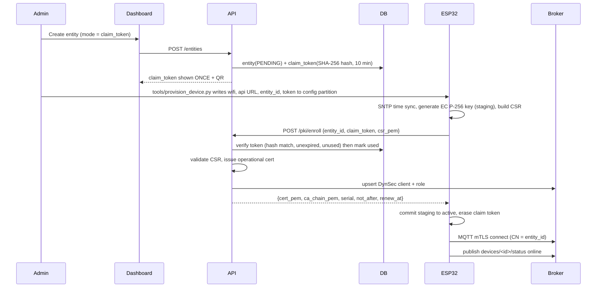

# AuthSphere — System Architecture

> **Audience:** an AI coding agent (Antigravity).
> **Companion file:** `PROJECT.md` (scope, requirements, phases, rules). Read both fully before coding.
> This file is the **technical source of truth**: components, ports, PKI, data model, API, protocols, firmware behaviour, deployment.
> Anything not specified here must be logged in `docs/DECISIONS.md` (see `PROJECT.md` §10 rule 2). Do not guess silently.

## Contents
1. System overview
2. Containers, ports, networks
3. PKI design
4. Broker design (Mosquitto)
5. Lifecycle flows
6. Backend design (process model, data model, workers, audit)
7. Proof-of-Possession (PoP) request authentication
8. REST and WebSocket API
9. Messenger (end-to-end encryption)
10. ESP32 firmware
11. Dashboard
12. Deployment and configuration
13. Repository layout
14. Testing strategy

---

## 1. System overview

```
                         INTERNET
      ┌──────────────────────┼──────────────────────────┐
      │ HTTPS 443            │ mTLS MQTT 8883           │
      ▼                      ▼                          │
┌───────────┐         ┌─────────────┐                   │
│  Caddy    │         │  Mosquitto  │◄── ESP32 devices  │
│ (web TLS) │         │ + DynSec    │◄── Pi A / Pi B    │
└─────┬─────┘         └──┬───────▲──┘    (messenger)    │
      │ /api, /ws        │       │                      │
      ▼                  │ MQTT  │ dynsec control       │
┌───────────┐  telemetry,│ (mTLS)│ + CRL file           │
│   API     │◄───────────┘       │                      │
│ (FastAPI) │────────────────────┘                      │
│  CA, PKI  │          ┌───────────┐                    │
│  policies │◄────────►│  Bridge   │ (workers: ingest,  │
└─────┬─────┘          │ (Python)  │  log parser, kicker│
      │                └─────┬─────┘  rotation watcher) │
      ▼                      ▼                          │
┌──────────────────────────────────┐                    │
│           PostgreSQL 16          │   Dashboard (React, static, served by Caddy)
└──────────────────────────────────┘
```

**Two trust channels, kept separate:**
- **Device ↔ broker:** MQTT over **mutual TLS**, trust anchored in the **AuthSphere root CA** (pinned in firmware).
- **Device ↔ API (enroll/rotate):** HTTPS (public Let's Encrypt cert on the web hostname, verified with ESP-IDF's built-in certificate bundle) **plus** application-layer **PoP signatures** (§7). The device authenticates to the API by proving possession of its private key.

**Principle:** the private key of a device or user never leaves it (Mode A) or is unique per device and lives only in a non-firmware partition (Mode B).

---

## 2. Containers, ports, networks

| Service | Image | Exposed to host | Internal port | Notes |
|---|---|---|---|---|
| `caddy` | `caddy:2` | **80, 443** | — | TLS for web; serves dashboard static files; proxies `/api/*` to `api` |
| `mosquitto` | `eclipse-mosquitto:2.0.x` (pin patch version) | **8883** (demo profile also 1883) | 8883 | mTLS MQTT; **TLS terminates at the broker, never at a proxy** (broker must see the client cert) |
| `api` | built from `backend/` | none | 8000 | `uvicorn app.main:app` |
| `bridge` | same image as `api` | none | — | `python -m app.workers.main` |
| `postgres` | `postgres:16` | none | 5432 | volume `pgdata` |
| `dashboard-build` | built from `dashboard/` | none | — | one-shot: builds Vite app into volume `dashboard-dist` read by `caddy` |

**Network:** one user-defined bridge network `authsphere-net`. Only `caddy` and `mosquitto` publish ports.

**Volumes:** `pgdata`, `mosquitto-data` (persistence + `dynamic-security.json`), `pki-state` (public PKI artifacts: intermediate cert, chain, CRL, service certs; `api` read-write, `mosquitto` read-only), `caddy-data`, `dashboard-dist`.

**Secrets (Docker secrets, files under `/run/secrets/`):** `intermediate_key`, `svc_api_key`, `svc_bridge_key`, `jwt_secret`, `fernet_key`, `postgres_password`, `dynsec_admin_password`.

**Compose profiles:** `prod` (normal) and `demo` (= prod + demo-only extras: plaintext listener 1883, `/api/v1/demo/*` endpoints, `ENV=demo`).

---

## 3. PKI design

### 3.1 Hierarchy

```
AuthSphere Root CA            (offline; EC P-256; 10 years)
   └── AuthSphere Intermediate CA   (online in `api`; EC P-256; 2 years)
          ├── broker server cert          (90 days)
          ├── service certs: svc-api, svc-bridge   (365 days)
          ├── bootstrap certs  (per device, Mode B; 365 days; cannot connect to MQTT)
          └── operational certs (per entity; short-lived; used for MQTT)
```

- **Algorithms:** EC **P-256 (secp256r1)** keys everywhere; signature **ECDSA with SHA-256**. No RSA anywhere.
- **Root key** is generated by `tools/init_pki.py` into `./pki-offline/` and must be moved to offline storage by the operator. It is **never** mounted into any container. Only `root.crt` (public) is distributed.
- **Intermediate key** is a Docker secret mounted into `api` only.

### 3.2 Certificate profiles

| Cert | Subject | Key Usage | Extended Key Usage | Basic Constraints | Lifetime |
|---|---|---|---|---|---|
| Root | `CN=AuthSphere Root CA, O=AuthSphere` | keyCertSign, cRLSign | — | CA:true, pathlen:1 | 3650 d |
| Intermediate | `CN=AuthSphere Intermediate CA, O=AuthSphere` | keyCertSign, cRLSign, digitalSignature | — | CA:true, pathlen:0 | 730 d |
| Broker server | `CN=<MQTT_PUBLIC_HOSTNAME>` + SAN DNS: `<MQTT_PUBLIC_HOSTNAME>`, `mosquitto` | digitalSignature | serverAuth | CA:false | 90 d |
| Service | `CN=svc-api` / `svc-bridge`, `OU=service` | digitalSignature | clientAuth | CA:false | 365 d |
| **Operational** | `CN=<entity_id>, OU=<role_name>, O=AuthSphere` + SAN URI `urn:authsphere:entity:<entity_id>` | digitalSignature | **clientAuth** | CA:false | role policy (default 7 d; demo 120 s) |
| **Bootstrap** | `CN=<entity_id>, OU=bootstrap, O=AuthSphere` | digitalSignature | **only** private OID `1.3.6.1.4.1.99999.1.1` (placeholder arc, no clientAuth) | CA:false | 365 d |

All end-entity certs include: Subject Key Identifier, Authority Key Identifier, and a CRL Distribution Point `https://<PUBLIC_HOSTNAME>/api/v1/pki/crl.pem`.

**Why the bootstrap EKU matters:** because it lacks `clientAuth`, OpenSSL (inside Mosquitto) rejects it for MQTT client authentication. Bootstrap certs can therefore only be used for PoP against the API (defence in depth, tested by AL-9).

### 3.3 Issuance rules (server side, in `app/pki/ca.py`)
1. Accept a PEM CSR. Verify: self-signature valid; public key is **EC P-256**; reject anything else.
2. **Ignore** the subject and all extensions inside the CSR. The server builds the subject and extensions itself from the entity record (entity_id → CN, role → OU). This prevents a device from asking for another identity.
3. Serial number: random 159-bit positive integer, stored as lowercase hex.
4. Compute `not_before = now − 60 s` (clock-skew tolerance), `not_after = now + lifetime`.
5. Lifetime: `role.cert_lifetime_seconds`, unless demo mode is active (then `DEMO_CERT_LIFETIME_SECONDS`, default 120).
6. Return the leaf certificate PEM and the chain PEM (intermediate + root).

### 3.4 Revocation (CRL)
- CRL signed by the intermediate, containing all certificates with `status = revoked`, with a monotonic CRL number (`ca_state.crl_number`).
- `nextUpdate = now + 7 days`; regenerated **on every revoke** and **hourly** by a worker. **Important:** OpenSSL fails closed on an expired CRL (all connections would be rejected), so the hourly refresh is mandatory and an alert is raised if the CRL is older than 48 h.
- Written atomically (temp file + rename) to `/pki-state/crl.pem`, served at `GET /api/v1/pki/crl.pem`.
- The `mosquitto` container runs a tiny watcher in its entrypoint (`inotifywait` on `crl.pem`) that sends `SIGHUP` to Mosquitto on change.
- **Immediate cut-off does not depend on the CRL:** revocation also deletes the entity's DynSec client, which kicks live sessions (§4.4). The CRL is the second line of defence for new connection attempts.

---

## 4. Broker design (Mosquitto 2.0.x + Dynamic Security)

### 4.1 `mosquitto.conf` (production profile)

```conf
# Global
allow_anonymous false
persistence true
persistence_location /mosquitto/data/
persistent_client_expiration 7d
max_packet_size 10240
message_size_limit 10240
log_dest stdout
log_dest topic            # publishes log lines to $SYS/broker/log/<LEVEL>
log_type error
log_type warning
log_type notice
log_type information
connection_messages true

# Dynamic Security (ACLs and roles managed by the API)
plugin /usr/lib/mosquitto_dynamic_security.so    # verify path in the pinned image
plugin_opt_config_file /mosquitto/data/dynamic-security.json

# The only production listener: mutual TLS
listener 8883 0.0.0.0
protocol mqtt
cafile   /mosquitto/pki/ca-chain.pem     # intermediate + root
certfile /mosquitto/pki/broker.crt
keyfile  /mosquitto/pki/broker.key
crlfile  /mosquitto/pki/crl.pem
require_certificate true
use_identity_as_username true            # username := certificate CN
ciphers ECDHE-ECDSA-AES128-GCM-SHA256:ECDHE-ECDSA-AES256-GCM-SHA384:ECDHE-ECDSA-CHACHA20-POLY1305
ciphers_tls1.3 TLS_AES_128_GCM_SHA256:TLS_AES_256_GCM_SHA384
```

**Demo profile addition (`mosquitto.demo.conf`, included only when `--profile demo`):**
```conf
# Demo-only plaintext listener, to show in Wireshark what the old insecure model looks like.
listener 1883 0.0.0.0
protocol mqtt
# Clients here need username/password (global allow_anonymous false) and are
# limited by DynSec to the single topic tree demo/plaintext/#. They cannot reach device or chat topics.
```

### 4.2 MQTT topic scheme

| Topic | Direction | Purpose |
|---|---|---|
| `devices/<id>/status` | device → bridge (retained, QoS 1) | Presence + info. Online payload: `{"state":"online","cert_serial":"<hex>","fw":"1.0.0","ts":<unix>}`. **Last Will** payload: `{"state":"offline"}` |
| `devices/<id>/telemetry` | device → bridge (QoS 0/1) | Sensor JSON, e.g. `{"t":24.6,"h":51.2,"uptime":1234}` |
| `devices/<id>/benchmark` | device → bridge | Crypto benchmark results (see §10.6) |
| `devices/<id>/ack` | device → bridge | Command acknowledgements |
| `devices/<id>/cmd/<name>` | bridge/API → device | Commands. Supported: `rotate` (payload `{}`) |
| `chat/<recipient_id>/inbox` | user → recipient (QoS 1) | E2E encrypted envelopes (§9) |
| `users/<id>/status` | user → bridge (retained) | Messenger presence |
| `$CONTROL/dynamic-security/v1` | `svc-api` → broker | DynSec admin commands |
| `$SYS/broker/log/#` | broker → `svc-bridge` | Broker log lines (TLS rejects, ACL denies, connects) |
| `demo/plaintext/#` | demo profile only | Plaintext demo traffic |

### 4.3 Roles and ACLs

`%u` is the DynSec substitution for the connecting username (= entity ID). Every **subscribe** permission needs a matching **`publishClientReceive`** ACL with the same topic pattern or the client will not receive messages. The API's role sync (§6.5) always creates both.

| Role (`roles.name`) | Entity type | Publish allowed | Subscribe allowed |
|---|---|---|---|
| `sensor` | device | `devices/%u/status`, `devices/%u/telemetry`, `devices/%u/benchmark`, `devices/%u/ack` | `devices/%u/cmd/#` |
| `actuator` | device | same as `sensor` | same as `sensor` |
| `chat-user` | user | `chat/+/inbox`, `users/%u/status` | `chat/%u/inbox` |
| `service-bridge` | service | `devices/+/cmd/#` | `devices/+/#`, `users/+/status`, `$SYS/broker/log/#`, `chat/+/inbox` (only when inspector enabled) |
| `service-api` | service | `$CONTROL/dynamic-security/#`, `devices/+/cmd/#` | `$CONTROL/dynamic-security/#` |

Built-in roles are seeded by migration and flagged `builtin = true` (admin can edit lifetimes/topics of `sensor`, `actuator`, `chat-user`; cannot delete built-ins).

### 4.4 ⚠ Phase 0 verification spike — three broker assumptions

The design depends on three Mosquitto behaviours. **Verify each with a script in `tools/spike/` before building on them** and record results in `docs/DECISIONS.md`.

| ID | Assumption | How to verify |
|---|---|---|
| **A1** | A client authenticated only by its certificate (no password; `use_identity_as_username true`) is subject to the ACLs of the DynSec client whose username equals the cert CN; `%u` patterns work. | Create DynSec client `dev-test` with role `sensor`. Connect with cert CN=`dev-test`. Publishing to `devices/dev-test/telemetry` works; to `devices/other/telemetry` is denied. |
| **A2** | DynSec `disableClient` / `deleteClient` disconnects the live session of that username. | Connect, then send the command; confirm the session drops within 2 s. |
| **A3** | (a) Replacing `crlfile` and sending `SIGHUP` makes the broker reject revoked certs for new connections. (b) `log_dest topic` publishes TLS-failure and ACL-denied lines to `$SYS/broker/log/#`. | Revoke a cert, regenerate CRL, SIGHUP, attempt connect; subscribe to `$SYS/broker/log/#` while causing failures; save the **exact** log lines as test fixtures. |

**Fallback if A1 or A2 fails:** switch the broker to **EMQX 5** (HTTP authorization hook calling the API, REST API to kick clients). To keep this swap cheap, all broker administration goes through one interface in `app/broker/base.py`:

```python
class BrokerAdmin(Protocol):
    async def upsert_role(self, role: Role) -> None: ...
    async def upsert_client(self, entity_id: str, role_name: str) -> None: ...
    async def set_client_enabled(self, entity_id: str, enabled: bool) -> None: ...
    async def delete_client(self, entity_id: str) -> None: ...
    async def kick(self, entity_id: str) -> None: ...
```
Primary implementation: `app/broker/dynsec.py`. Do not call DynSec from anywhere else.

### 4.5 Broker log parsing

`app/broker/log_parser.py` converts lines received on `$SYS/broker/log/#` into events. It is a **table of regular expressions → event type**, unit-tested against the real sample lines captured in Phase 0 (do **not** assume formats). Unknown lines are ignored.

| Event type | Meaning | Notes |
|---|---|---|
| `broker.tls_reject` | TLS handshake failed (bad/unknown/expired/revoked cert, no cert) | No identity is available (handshake failed) → record source IP + reason text only |
| `broker.acl_deny` | `Denied PUBLISH` / `Denied SUBSCRIBE` | Extract client/username and topic |
| `broker.connect` / `broker.disconnect` | Connection messages | WebSocket + `last_seen` only (not written to audit log; too noisy) |

`broker.tls_reject`, `broker.acl_deny`, and kicks **are** written to the audit log.

### 4.6 Presence
`online` is derived from the retained `devices/<id>/status` topic and its Last Will. The bridge updates `entities.online`, `last_seen_at`, `fw_version`, and the cert serial reported in the status payload.

---

## 5. Lifecycle flows

### 5.1 Entity state machine

```
 PENDING ──(first operational cert issued)──► ACTIVE ──(not_after passed, no rotation)──► EXPIRED
    ▲                                           │                                           │
    └──────────(admin re-issues claim token)────┴───────────────────────────────────────────┘
 any state ──(admin revoke)──► REVOKED   (terminal; to reuse the ID, delete and recreate)
```
Derived (not stored) flags: `rotation_due` (now > renew_at), `at_risk` (past 80 % of lifetime and not rotated), `online`.

### 5.2 Mode A — claim-token enrollment



### 5.3 Mode B — factory provisioning (pre-flashed unique identity)

1. Admin creates the entity with `mode = factory`.
2. Operator runs `python tools/provision_device.py --port /dev/ttyUSB0 --entity dev-demo-02`.
3. Script logs in (email, password, TOTP), **generates a unique EC key pair locally**, builds a CSR, calls `POST /provision/bootstrap`, receives the **bootstrap certificate**.
4. Script builds an **encrypted NVS image** (Wi-Fi, API URL, MQTT host, entity ID, bootstrap key + cert, root CA PEM(s)) and flashes it to the `auth_cfg` partition with `esptool`. The firmware binary is identical for every device.
5. Script **securely deletes** the key material from the host.
6. First boot: device calls `POST /pki/rotate` with `cert_kind = bootstrap` (PoP signed with the bootstrap key) and a fresh CSR → receives its first operational cert → ACTIVE. From here on it is identical to Mode A.

### 5.4 Rotation (automatic, manual, emergency)

```mermaid
sequenceDiagram
  participant Dev as ESP32
  participant API
  participant DB
  participant Broker
  participant Bridge
  Note over Dev: renew_at reached (66% of lifetime + jitter) OR cmd/rotate received
  Dev->>Dev: generate NEW key in STAGING slot, build CSR
  Dev->>API: POST /pki/rotate (PoP signed with CURRENT key)
  API->>API: verify PoP, entity, cert status; validate CSR
  API->>DB: new cert status=issued; rotation_event(issued)
  API-->>Dev: new cert + chain + renew_at
  Dev->>Dev: store cert in staging
  Dev->>Broker: test connect with NEW cert (separate short-lived connection)
  alt test connect OK
    Dev->>Dev: COMMIT staging to active, drop old key
    Dev->>Broker: reconnect main session with new cert (persistent session, QoS1)
    Dev->>Broker: publish status online (new cert_serial)
    Bridge->>DB: status shows new serial: new cert=active, old cert=revoked(superseded), rotation_event=confirmed
    Bridge->>API: publish CRL
  else test connect fails
    Dev->>Dev: ROLLBACK (keep old identity), retry with exponential backoff
  end
  Note over Bridge: If no confirmation within ROTATION_CONFIRM_TIMEOUT: new cert revoked(unconfirmed), old stays active, event=timeout
```

**Certificate status values:** `issued` (new, unconfirmed), `active`, `revoked` (with `revoke_reason`: `superseded`, `unconfirmed`, `admin`, `compromised`), `expired`. At most one `active` operational cert per entity at any time; `issued` may overlap briefly.

**Retry rule:** if the device calls `/pki/rotate` again while an `issued` cert exists, the API revokes that stale `issued` cert (`unconfirmed`) and issues a fresh one.

**Failure/recovery table**

| Situation | Behaviour |
|---|---|
| Rotation request lost / network drop | Device keeps old identity, retries with backoff. Old cert still valid. |
| New cert issued but device never confirmed | Confirm-timeout worker revokes the new cert, old stays active; event `timeout`. |
| Device missed its window and cert expired | Entity → `EXPIRED`, session kicked. Admin re-issues a claim token; device re-enrolls (serial CLI `claim <token>`) or, in Mode B, re-activates with its bootstrap identity. |
| Compromise suspected | Admin **Revoke** (immediate kick) or bulk emergency revoke/rotate by role. |

### 5.5 Revocation

`POST /entities/{id}/revoke` performs, in order, in **one request**:
1. DB: entity → `REVOKED`; all `issued`/`active` certs → `revoked` (reason from request); pending claim tokens invalidated.
2. `BrokerAdmin.set_client_enabled(id, False)` then `delete_client(id)` → live session dropped.
3. Regenerate and publish CRL (broker reload via watcher).
4. Audit entry `entity.revoke`; WebSocket event `pki.revoked`.

Target: session disconnected **< 2 s** after the API call returns.

### 5.6 Expiry handling
The `expiry_kicker` worker (every 15 s):
- For each entity with `active` operational cert where `not_after < now` and no `issued` replacement: set cert `expired`, entity `EXPIRED`, `BrokerAdmin.kick`, audit `entity.state_change`.
- For each `ACTIVE` entity whose last reported `status.cert_serial` ≠ its current active serial for more than 60 s after rotation confirmation: `kick` (forces reconnect with the new cert). `kick` = disable then re-enable the DynSec client.

---

## 6. Backend design

### 6.1 Process model
- `api` process: FastAPI app (REST + WebSocket). Stateless apart from DB and `pki-state`.
- `bridge` process: single asyncio program (`app/workers/main.py`) running these tasks concurrently: `ingest`, `log_events`, `expiry_kicker`, `rotation_watcher`, `crl_refresher`, `retention`. It connects to Mosquitto as `svc-bridge` (mTLS) and to Postgres.
- Event fan-out to dashboards: `bridge` writes to Postgres and issues `NOTIFY authsphere_events, '<json>'`; `api` `LISTEN`s and forwards to WebSocket clients. (No Redis.)
- Both processes share `app/` code (models, services, pki, broker).

### 6.2 Data model (PostgreSQL; implement exactly via Alembic)

```sql
CREATE TYPE entity_type      AS ENUM ('device','user','service');
CREATE TYPE entity_state     AS ENUM ('PENDING','ACTIVE','EXPIRED','REVOKED');
CREATE TYPE prov_mode        AS ENUM ('claim_token','factory');
CREATE TYPE cert_kind        AS ENUM ('bootstrap','operational');
CREATE TYPE cert_status      AS ENUM ('issued','active','revoked','expired');
CREATE TYPE issued_via       AS ENUM ('enroll','provision','rotate');
CREATE TYPE rotation_trigger AS ENUM ('scheduled','manual','emergency','recovery');
CREATE TYPE rotation_status  AS ENUM ('issued','confirmed','timeout');
CREATE TYPE dash_role        AS ENUM ('admin','operator','viewer');

CREATE TABLE dashboard_users (
  id uuid PRIMARY KEY, email text UNIQUE NOT NULL, password_hash text NOT NULL,
  role dash_role NOT NULL, totp_secret_enc bytea, totp_enabled boolean NOT NULL DEFAULT false,
  created_at timestamptz NOT NULL DEFAULT now(), last_login_at timestamptz
);

CREATE TABLE roles (
  name text PRIMARY KEY, entity_type entity_type NOT NULL, description text,
  cert_lifetime_seconds int NOT NULL CHECK (cert_lifetime_seconds >= 60),
  renew_at_pct int NOT NULL CHECK (renew_at_pct BETWEEN 50 AND 90),
  pub_topics text[] NOT NULL, sub_topics text[] NOT NULL, builtin boolean NOT NULL DEFAULT false
);

CREATE TABLE entities (
  id text PRIMARY KEY CHECK (id ~ '^[a-z0-9][a-z0-9-]{2,31}$'),
  entity_type entity_type NOT NULL, display_name text, role_name text NOT NULL REFERENCES roles(name),
  state entity_state NOT NULL DEFAULT 'PENDING', provisioning_mode prov_mode NOT NULL,
  hw_model text, fw_version text, online boolean NOT NULL DEFAULT false, last_seen_at timestamptz,
  current_cert_serial text, metadata jsonb NOT NULL DEFAULT '{}',
  created_by uuid REFERENCES dashboard_users(id), created_at timestamptz NOT NULL DEFAULT now(),
  updated_at timestamptz NOT NULL DEFAULT now(), revoked_at timestamptz, revoke_reason text
);

CREATE TABLE claim_tokens (
  id uuid PRIMARY KEY, entity_id text NOT NULL REFERENCES entities(id) ON DELETE CASCADE,
  token_hash bytea NOT NULL,            -- SHA-256 of the token; the token itself is never stored
  expires_at timestamptz NOT NULL, used_at timestamptz,
  created_by uuid REFERENCES dashboard_users(id), created_at timestamptz NOT NULL DEFAULT now()
);

CREATE TABLE certificates (
  serial text PRIMARY KEY, entity_id text NOT NULL REFERENCES entities(id) ON DELETE CASCADE,
  kind cert_kind NOT NULL, status cert_status NOT NULL, issued_via issued_via NOT NULL,
  not_before timestamptz NOT NULL, not_after timestamptz NOT NULL,
  fingerprint_sha256 text NOT NULL, public_key_pem text NOT NULL, cert_pem text NOT NULL,
  revoked_at timestamptz, revoke_reason text, created_at timestamptz NOT NULL DEFAULT now()
);
CREATE INDEX ON certificates (entity_id, status);

CREATE TABLE rotation_events (
  id bigserial PRIMARY KEY, entity_id text NOT NULL REFERENCES entities(id) ON DELETE CASCADE,
  old_serial text, new_serial text NOT NULL, trigger rotation_trigger NOT NULL,
  status rotation_status NOT NULL, error text,
  created_at timestamptz NOT NULL DEFAULT now(), confirmed_at timestamptz
);

CREATE TABLE pop_nonces (
  entity_id text NOT NULL, nonce text NOT NULL, expires_at timestamptz NOT NULL,
  PRIMARY KEY (entity_id, nonce)
);

CREATE TABLE audit_log (
  id bigserial PRIMARY KEY, ts timestamptz NOT NULL DEFAULT now(),
  category text NOT NULL, action text NOT NULL,
  actor_type text NOT NULL,             -- dashboard_user | entity | system | broker
  actor_id text, entity_id text, outcome text NOT NULL,   -- success | denied | error
  detail jsonb NOT NULL DEFAULT '{}',
  prev_hash bytea NOT NULL, hash bytea NOT NULL
);

CREATE TABLE telemetry (
  id bigserial PRIMARY KEY, entity_id text NOT NULL, ts timestamptz NOT NULL DEFAULT now(), payload jsonb NOT NULL
);
CREATE INDEX ON telemetry (entity_id, ts DESC);

CREATE TABLE benchmarks (
  id bigserial PRIMARY KEY, entity_id text NOT NULL, ts timestamptz NOT NULL DEFAULT now(),
  algorithm text NOT NULL, operation text NOT NULL, iterations int NOT NULL,
  avg_ms numeric NOT NULL, heap_bytes int, extra jsonb NOT NULL DEFAULT '{}'
);

CREATE TABLE chat_keys (
  kid text PRIMARY KEY,                 -- first 16 hex chars of SHA-256(enc_public_key raw bytes)
  entity_id text NOT NULL REFERENCES entities(id) ON DELETE CASCADE,
  enc_public_key bytea NOT NULL,        -- 65-byte uncompressed P-256 point
  signing_serial text NOT NULL REFERENCES certificates(serial),
  signature bytea NOT NULL, status text NOT NULL DEFAULT 'active',  -- active | retired
  created_at timestamptz NOT NULL DEFAULT now()
);

CREATE TABLE ca_state (id int PRIMARY KEY CHECK (id = 1), crl_number bigint NOT NULL, crl_updated_at timestamptz);
CREATE TABLE settings (key text PRIMARY KEY, value jsonb NOT NULL);   -- e.g. demo_mode
```

### 6.3 Role policy defaults (seeded)

| Role | Entity type | Lifetime | Renew at |
|---|---|---|---|
| `sensor` | device | 7 d (604800 s) | 66 % |
| `actuator` | device | 7 d | 66 % |
| `chat-user` | user | 7 d | 66 % |
| `service-bridge`, `service-api` | service | 365 d (issued by `tools/`, not rotated by devices) | — |

**Demo mode:** when active (`settings.demo_mode = true`, toggled by admin; forbidden when `ENV=prod`), operational lifetime is `DEMO_CERT_LIFETIME_SECONDS` (120), renew-at 60 %, jitter ≤ 2 s, `ROTATION_CONFIRM_TIMEOUT_SECONDS` 30.

### 6.4 Claim tokens
32 random bytes, URL-safe base64. Stored as SHA-256 hash only. Valid 10 minutes (`CLAIM_TOKEN_TTL_SECONDS`). Compared in constant time. On successful enrollment `used_at` is set in the same transaction as certificate issuance.

### 6.5 Broker sync
- On startup and on role change: `BrokerAdmin.upsert_role` for every role (creates `publishClientSend`, `subscribePattern`, and matching `publishClientReceive` ACLs per §4.3).
- On first operational cert issuance for an entity: `upsert_client(entity_id, role_name)` (random unused password set and discarded; authentication is by certificate only).
- On revoke/delete: `delete_client`.
- DynSec admin identity: `svc-api` connects with its client certificate; `tools/init_pki.py` + `broker/dynsec_init.sh` bootstrap `svc-api` and `svc-bridge` as DynSec clients with the right roles (using `mosquitto_ctrl dynsec init` with the `dynsec_admin_password` secret).

### 6.6 Workers (`bridge`)

| Worker | Interval | Duty |
|---|---|---|
| `ingest` | event-driven | Subscribe `devices/+/status`, `devices/+/telemetry`, `devices/+/benchmark`, `devices/+/ack`, `users/+/status`; update entities; insert telemetry/benchmarks; confirm rotations (§5.4); `NOTIFY` events |
| `log_events` | event-driven | Subscribe `$SYS/broker/log/#`; parse (§4.5); audit + `NOTIFY` |
| `chat_inspector` | event-driven | Only if `CHAT_INSPECTOR_ENABLED`: subscribe `chat/+/inbox`; forward **envelope metadata + ciphertext** as `chat.envelope` events. Never stored in DB. |
| `expiry_kicker` | 15 s | §5.6 |
| `rotation_watcher` | 15 s | Rotation events still `issued` after `ROTATION_CONFIRM_TIMEOUT_SECONDS` (default 300) → `timeout`, revoke new cert (`unconfirmed`), publish CRL |
| `crl_refresher` | 1 h | Regenerate CRL; alert if older than 48 h |
| `retention` | 1 h | Delete telemetry older than `TELEMETRY_RETENTION_HOURS` (24), expired `pop_nonces`, benchmarks older than 30 d |

### 6.7 Audit log hash chain
- Genesis `prev_hash` = 32 zero bytes.
- `hash = SHA256( prev_hash || canonical_json )` where `canonical_json` = UTF-8 JSON of `{ts, category, action, actor_type, actor_id, entity_id, outcome, detail}` with sorted keys, no whitespace, `ts` as ISO-8601 UTC with microseconds.
- Inserts are serialized with `pg_advisory_xact_lock(7001)` so the chain has no forks.
- `GET /audit/verify` recomputes the whole chain and returns `{valid, checked, first_bad_id}`.
- No update/delete code paths for `audit_log` may exist.

### 6.8 Security controls (all required)
- Dashboard passwords: **argon2id**. TOTP mandatory for every dashboard user; secret stored encrypted with Fernet (`fernet_key` secret).
- JWT access token 15 min; refresh token 7 d in an `HttpOnly; Secure; SameSite=Strict` cookie. WebSocket uses a one-time **ticket** (`POST /auth/ws-ticket`, valid 30 s) so JWTs never appear in URLs.
- Rate limits (`slowapi`): login 5/min/IP; enroll 10/min/IP; rotate 30/min/entity; others 120/min/user.
- CORS: same-origin only. Security headers set by Caddy (§12.4).
- Containers run as non-root, read-only root filesystem where feasible; only needed volumes writable.
- Logging: `structlog` JSON with a redaction processor removing keys matching `(key|token|password|secret|csr|totp)`.
- Constant-time comparison for tokens and hashes; generic client errors, detailed reason only in audit log.
- Allowed crypto: ECDSA-P256/SHA-256, ECDH-P256, HKDF-SHA256, AES-256-GCM, SHA-256. Forbidden: RSA, MD5, SHA-1, ECB, static nonces.

### 6.9 Audit action names (the complete list; write an entry for each)

| Category | Actions |
|---|---|
| `auth` | `auth.login_ok`, `auth.login_denied`, `auth.totp_failed`, `auth.logout` |
| `admin` | `user.create`, `user.update`, `user.delete`, `role.create`, `role.update`, `role.delete`, `settings.demo_mode_changed` |
| `entity` | `entity.create`, `entity.claim_token_issued`, `entity.state_change`, `entity.revoke`, `entity.delete` |
| `pki` | `pki.enroll_ok`, `pki.enroll_denied`, `pki.provision_ok`, `pki.rotate_ok`, `pki.rotate_denied`, `pki.rotate_confirmed`, `pki.rotate_timeout`, `pki.crl_published`, `pki.cert_revoked` |
| `broker` | `broker.tls_reject`, `broker.acl_deny`, `broker.kick` |
| `bulk` | `bulk.revoke`, `bulk.rotate` |
| `chat` | `chat.key_registered` |
| `audit` | `audit.verify` |
| `demo` | `demo.expired_cert_issued` (demo profile only) |

---

## 7. Proof-of-Possession (PoP) request authentication

Used by `POST /pki/rotate` and the messenger directory endpoints. It lets a device authenticate with its private key over plain HTTPS.

**Request headers**

| Header | Value |
|---|---|
| `X-AS-Entity` | entity ID |
| `X-AS-Serial` | lowercase hex serial of the certificate whose key signs the request |
| `X-AS-Timestamp` | Unix seconds (integer) |
| `X-AS-Nonce` | 16 random bytes, lowercase hex (32 chars) |
| `X-AS-Signature` | Base64 of the **DER-encoded ECDSA-SHA256** signature |

**Signing string** (UTF-8, lines joined by `\n`, **no** trailing newline):
```
AUTHSPHERE-POP-V1
<HTTP method, uppercase>
<request path, including /api/v1 prefix, without query string>
<lowercase hex SHA-256 of the raw request body bytes (empty body = SHA-256 of empty string)>
<timestamp>
<nonce>
<entity_id>
<serial>
```

**Server verification (in `app/core/pop.py`, as a FastAPI dependency), in this order; any failure → HTTP 401 `invalid_signature` (generic) and an audit entry with the real reason:**
1. `|now − timestamp| ≤ POP_MAX_SKEW_SECONDS` (120).
2. Insert `(entity_id, nonce)` into `pop_nonces` with 10-minute TTL; unique violation = replay.
3. Entity exists and is not `REVOKED`.
4. Certificate by serial belongs to that entity, status `active`, not expired, and its `kind` is allowed for the endpoint (`/pki/rotate` accepts `bootstrap` and `operational`; directory endpoints accept `operational` only).
5. ECDSA verification with the certificate's public key over the signing string.

---

## 8. REST and WebSocket API

### 8.1 Conventions
- Base path `/api/v1`. JSON only. Timestamps ISO-8601 UTC (`2026-10-03T10:15:00Z`). OpenAPI served at `/api/v1/docs` (disabled when `ENV=prod`).
- Auth types: **public**, **JWT** (dashboard, `Authorization: Bearer`), **PoP** (§7). Dashboard roles: `viewer` < `operator` < `admin`.
- Pagination: `?limit=50&cursor=<opaque>`; responses `{ "items": [...], "next_cursor": "..."|null }`.
- **Error shape (every error, no exceptions):**
```json
{ "error": { "code": "token_expired", "message": "Human readable text", "request_id": "01J..." } }
```

| HTTP | `code` examples |
|---|---|
| 400 | `invalid_request`, `invalid_csr` |
| 401 | `unauthorized`, `invalid_signature`, `totp_required` |
| 403 | `forbidden` |
| 404 | `not_found` |
| 409 | `conflict`, `token_used`, `invalid_state` |
| 410 | `token_expired` |
| 429 | `rate_limited` |
| 500 | `internal` |

### 8.2 Endpoints

| Method | Path | Auth | Purpose |
|---|---|---|---|
| GET | `/health` | public | Liveness + DB check |
| GET | `/pki/ca.pem` | public | Root + intermediate chain |
| GET | `/pki/crl.pem` | public | Current CRL |
| POST | `/pki/enroll` | public (claim token) | Mode A first certificate |
| POST | `/pki/rotate` | **PoP** | Rekey/rotate; also Mode B first activation |
| POST | `/provision/bootstrap` | JWT operator+ | Issue bootstrap cert for a `factory` entity |
| POST | `/auth/login` | public | Email + password → `{totp_required}` or tokens |
| POST | `/auth/totp/verify` | partial login | Verify TOTP, issue tokens |
| POST | `/auth/totp/setup` | JWT | Begin TOTP enrollment (returns otpauth URI) |
| POST | `/auth/refresh` | refresh cookie | New access token |
| POST | `/auth/logout` | JWT | Clear refresh cookie |
| POST | `/auth/ws-ticket` | JWT | One-time WebSocket ticket |
| GET | `/auth/me` | JWT | Current dashboard user |
| GET | `/entities` | JWT viewer+ | List (filters: `type`, `state`, `role`, `online`, `q`) |
| POST | `/entities` | JWT operator+ | Create entity; returns claim token (mode A) once |
| GET | `/entities/{id}` | JWT viewer+ | Detail incl. current cert, derived flags |
| PATCH | `/entities/{id}` | JWT operator+ | Update `display_name`, `hw_model`, `metadata` |
| DELETE | `/entities/{id}` | JWT admin | Delete (must be REVOKED) |
| POST | `/entities/{id}/claim-token` | JWT operator+ | Re-issue claim token (PENDING/EXPIRED only) |
| POST | `/entities/{id}/rotate-now` | JWT operator+ | Publish `rotate` command to device |
| POST | `/entities/{id}/revoke` | JWT operator+ | Revoke (§5.5). Body `{"reason":"admin"\|"compromised"}` |
| GET | `/entities/{id}/certificates` | JWT viewer+ | Certificate history |
| GET | `/entities/{id}/rotations` | JWT viewer+ | Rotation events |
| GET | `/entities/{id}/telemetry` | JWT viewer+ | `?since=&limit=` |
| POST | `/entities/bulk/revoke` | JWT admin | Body `{"role":"sensor","reason":"compromised"}` |
| POST | `/entities/bulk/rotate` | JWT admin | Body `{"role":"sensor"}` → `rotate` command to all online |
| GET/POST/PATCH/DELETE | `/roles`, `/roles/{name}` | JWT (GET viewer+, others admin) | Policies |
| GET/POST/PATCH/DELETE | `/users`, `/users/{id}` | JWT admin | Dashboard users |
| GET | `/audit` | JWT viewer+ | Filters: `category`, `action`, `entity_id`, `outcome`, `since` |
| GET | `/audit/verify` | JWT viewer+ | Verify hash chain |
| GET | `/stats/overview` | JWT viewer+ | KPI numbers for the overview page |
| GET | `/benchmarks/latest` | JWT viewer+ | Latest benchmark per entity/algorithm/operation |
| GET/PUT | `/settings/demo-mode` | JWT admin | `{"enabled":bool}` (rejected when `ENV=prod`) |
| GET | `/directory/users` | PoP (user) or JWT | List users with active `kid` |
| GET | `/directory/users/{entity_id}` | PoP (user) or JWT | Active signing cert + chain + active enc key |
| GET | `/directory/certs/{serial}` | PoP (user) or JWT | Cert PEM + status + `revoked_at` |
| POST | `/directory/keys` | **PoP** (user) | Register/rotate messenger encryption key (§9.1) |
| POST | `/demo/issue-expired-cert` | JWT admin, `ENV=demo` only | Returns key + already-expired cert PEM for AL-3 |
| WS | `/ws/events` | ticket (`?ticket=`) | Live events (§8.4) |

### 8.3 Key payloads

**`POST /entities`**
```json
// request
{ "id": "dev-greenhouse-01", "entity_type": "device", "role_name": "sensor",
  "display_name": "Greenhouse sensor", "provisioning_mode": "claim_token", "hw_model": "ESP32-WROOM" }
// response 201
{ "entity": { "id": "dev-greenhouse-01", "state": "PENDING", "...": "..." },
  "claim_token": "q3N0…",            // ONLY for claim_token mode, ONLY in this response
  "claim_expires_at": "2026-10-03T10:25:00Z",
  "qr_payload": { "api_base": "https://auth.example.com/api/v1", "entity_id": "dev-greenhouse-01", "token": "q3N0…" } }
```

**`POST /pki/enroll`** (public)
```json
// request
{ "entity_id": "dev-greenhouse-01", "claim_token": "q3N0…", "csr_pem": "-----BEGIN CERTIFICATE REQUEST-----…" }
// response 200
{ "cert_pem": "…", "ca_chain_pem": "…", "serial": "3fa9…", "not_before": "…", "not_after": "…",
  "renew_at": "2026-10-08T22:00:00Z", "mqtt": { "host": "mqtt.example.com", "port": 8883 } }
```

**`POST /pki/rotate`** (PoP headers, body below)
```json
// request body
{ "csr_pem": "-----BEGIN CERTIFICATE REQUEST-----…", "trigger": "scheduled" }   // scheduled|manual|emergency|recovery
// response 200: same shape as enroll, plus
{ "rotation_id": 42 }
```

**`GET /entities/{id}`** (excerpt)
```json
{ "id": "dev-greenhouse-01", "entity_type": "device", "role_name": "sensor", "state": "ACTIVE",
  "online": true, "last_seen_at": "…", "fw_version": "1.0.0",
  "current_cert": { "serial": "3fa9…", "kind": "operational", "not_after": "…", "renew_at": "…",
                    "fingerprint_sha256": "…" },
  "flags": { "rotation_due": false, "at_risk": false } }
```

### 8.4 WebSocket events (`/ws/events`)

Envelope: `{ "type": "<type>", "ts": "<ISO>", "entity_id": "<id>|null", "data": { ... } }`

| `type` | `data` highlights |
|---|---|
| `entity.updated` | entity summary (state/online/fw/current serial) |
| `telemetry` | `payload` |
| `pki.enrolled` | `serial`, `not_after` |
| `pki.rotated` | `old_serial`, `new_serial`, `status` (`issued`/`confirmed`/`timeout`) |
| `pki.rotate_denied`, `pki.enroll_denied` | `reason` |
| `pki.revoked` | `reason` |
| `broker.tls_reject` | `source_ip`, `reason` |
| `broker.acl_deny` | `username`, `topic`, `action` |
| `broker.kick` | `reason` |
| `chat.envelope` | envelope fields + `ciphertext_preview` (inspector only) |
| `audit.appended` | audit row |

---

## 9. Messenger (end-to-end encryption)

Runs on Raspberry Pis as `clients/pi_messenger/`. The broker and backend never see plaintext.

### 9.1 Keys
Each `user` entity has two **separate** key pairs (key separation):
1. **Signing key** = the key of its operational certificate (ECDSA P-256). Also used for mTLS.
2. **Encryption key** = a dedicated **ECDH P-256** key pair generated by the client, stored at `~/.authsphere/enc_keys/<kid>.pem` (mode 0600).

`kid` = first 16 hex chars of SHA-256 of the 65-byte uncompressed public key.

**Registration** — `POST /directory/keys` (PoP-authenticated):
```json
{ "kid": "9a1f…", "enc_public_key_b64": "BASE64(65 bytes)", "signature_b64": "BASE64(DER ECDSA)" }
```
`signature` = ECDSA-SHA256 by the signing key over the UTF-8 string
`"AUTHSPHERE-CHATKEY-V1\n" + entity_id + "\n" + kid + "\n" + enc_public_key_b64`.
The server verifies it against the entity's active cert and stores the key. Previous keys become `retired` (clients keep retired private keys locally for 7 days to decrypt in-flight messages).

**Rotation:** whenever the messenger client rotates its certificate it also generates and registers a new encryption key.

### 9.2 Directory lookups (before sending)
Sender fetches `GET /directory/users/{recipient}` and **must** verify locally: certificate chain to the pinned root; EKU clientAuth; CN equals recipient ID; not expired; not revoked (status field and CRL); the encryption-key signature is valid under the recipient's cert.

### 9.3 Envelope v1 (JSON, published to `chat/<recipient>/inbox`, QoS 1)

```json
{
  "v": 1,
  "msg_id": "uuid4",
  "ts": 1767225600,
  "sender": "usr-alice",
  "recipient": "usr-bob",
  "sender_serial": "hex serial of sender's signing cert",
  "recipient_kid": "16 hex chars",
  "eph_pub": "b64 (65 bytes, ephemeral ECDH public key)",
  "salt": "b64 (32 random bytes)",
  "nonce": "b64 (12 random bytes)",
  "ciphertext": "b64 (ciphertext || 16-byte GCM tag)",
  "sig": "b64 (DER ECDSA-SHA256)"
}
```

### 9.4 Algorithms

**Send**
1. Generate an ephemeral P-256 key pair.
2. `shared = ECDH(eph_priv, recipient_enc_pub)`.
3. `key = HKDF-SHA256(ikm = shared, salt = salt, info = "AUTHSPHERE-CHAT-V1|" + sender + "|" + recipient + "|" + recipient_kid, length = 32)`.
4. `AAD` = canonical JSON (sorted keys, no whitespace, UTF-8) of `{v, msg_id, ts, sender, recipient, sender_serial, recipient_kid, eph_pub, salt}`.
5. `ciphertext = AES-256-GCM(key, nonce, plaintext_utf8, AAD)`.
6. `sig = ECDSA-SHA256(sender_signing_key, "AUTHSPHERE-CHAT-SIG-V1\n" + AAD + "\n" + nonce + "\n" + ciphertext)`.
7. Publish the envelope.

**Receive (reject on the first failure; show `REJECTED(<reason>)` locally; never crash)**
1. `v == 1`, `recipient == my_id`.
2. `ts` not more than 120 s in the future and not older than `CHAT_MAX_AGE_SECONDS` (default 86400). → `stale`
3. `msg_id` not in the local seen-store (SQLite, TTL = max age). → `replayed`
4. Fetch sender cert by `sender_serial` (`GET /directory/certs/{serial}`); verify chain, EKU, CN == `sender`. → `unknown_sender_cert`
5. Cert was valid at `ts`, and not revoked at or before `ts` (`revoked_at`). → `revoked_sender`
6. Verify `sig`. → `bad_signature`
7. Load the private key for `recipient_kid` (retired keys allowed). → `unknown_key`
8. ECDH → HKDF → AES-GCM decrypt with the same AAD. → `bad_tag`
9. Record `msg_id`; display plaintext.

### 9.5 Messenger attack commands
Available only when `AUTHSPHERE_ATTACK_MODE=1`, as CLI flags/TUI commands:

| Command | Action | Expected receiver result |
|---|---|---|
| `/tamper` | Flip one bit of the ciphertext before publishing | `REJECTED(bad_signature)` (signature check comes first) and, with signature checking disabled in a test build, `bad_tag` |
| `/forge` | Sign with a locally generated rogue key while claiming `usr-alice` | `REJECTED(bad_signature)` |
| `/replay` | Re-publish a previously captured envelope | `REJECTED(replayed)` |
| `/wrongkey` | Encrypt to a different recipient's key | `REJECTED(bad_tag)` or `unknown_key` |

### 9.6 Messenger Inspector (demo)
When `CHAT_INSPECTOR_ENABLED=true`, the bridge's `chat_inspector` subscribes to `chat/+/inbox` and the dashboard page shows each envelope (sender, recipient, ts, ciphertext preview) with a fixed banner: *"The server can route this message but cannot read it."*

---

## 10. ESP32 firmware (`firmware/esp32/`)

PlatformIO, framework **ESP-IDF**. C/C++. Language of comments: English.

### 10.1 Components

| Component | Responsibility |
|---|---|
| `wifi_mgr` | Connect to Wi-Fi from config partition; reconnect with backoff |
| `time_sync` | SNTP; **blocks all TLS work until system time is valid (year ≥ 2025)** — certificate validity checks depend on it |
| `config_store` | Reads encrypted NVS partition `auth_cfg` (Wi-Fi, URLs, entity ID, claim token, bootstrap identity, root CAs) |
| `identity_store` | Encrypted NVS slots `id_active`, `id_staging`, `id_boot`; atomic commit/rollback |
| `pki_client` | CSR generation (mbedTLS `pk` + `x509write_csr`, EC secp256r1), HTTPS calls to `/pki/enroll` and `/pki/rotate` (uses ESP-IDF certificate bundle) |
| `pop_signer` | Builds the PoP signing string and signs with the current key (§7) |
| `mqtt_link` | `esp-mqtt` over mTLS; LWT; persistent session; QoS 1 |
| `rotation_mgr` | Scheduling, staging, test-connect, commit/rollback (§5.4) |
| `telemetry` | Publishes JSON every 5 s (real sensor or simulated values) |
| `bench` | Crypto benchmark (§10.6) |
| `attack` | Attack mode (compiled only with `AUTHSPHERE_ATTACK_MODE`) |
| `cli` | Serial console commands |

### 10.2 Flash layout (`partitions.csv`)
Standard `nvs`, `phy_init`, `factory` app, plus `auth_cfg` (encrypted NVS, written by `provision_device.py`), `nvs_keys`. **No private key is ever compiled into the app binary.** Root CA public certificates are compiled in or provisioned as two slots: `root_current` and `root_next`.

### 10.3 State machine

```
BOOT → WIFI → TIME_SYNC → LOAD_IDENTITY
  LOAD_IDENTITY:
    active identity valid?                → CONNECT
    no active, has bootstrap identity?    → ACTIVATE   (POST /pki/rotate with cert_kind=bootstrap)
    no active, has claim token?           → ENROLL     (POST /pki/enroll)
    nothing usable?                       → RECOVERY_WAIT (wait for serial `claim <token>` or reprovision)
  ENROLL / ACTIVATE ok → store active → CONNECT      failure → BACKOFF → retry
  CONNECT  → mTLS MQTT up → publish status online → RUN
  RUN      → telemetry loop; on renew_at or cmd/rotate → ROTATE
  ROTATE   → (§5.4) success → CONNECT with new identity ; failure → rollback → RUN (retry with backoff)
  Any TLS failure caused by an expired/revoked certificate → LOAD_IDENTITY (will fall to RECOVERY_WAIT if nothing usable)
```

### 10.4 Behaviour details
- **Key generation** on device with the ESP32 hardware RNG via mbedTLS. EC P-256 only.
- **Rotation timing:** `renew_at` comes from the server response; the device adds random jitter (0–5 % of lifetime; in demo mode 0–2 s).
- **Commit** only after a successful test connection with the new credentials. **Rollback** keeps the old active slot untouched.
- **MQTT:** client ID = entity ID; `clean_session = false`; QoS 1; LWT on `devices/<id>/status` (`{"state":"offline"}`, retained). After commit the main session reconnects with the new certificate. Server certificate verified against `root_current` then `root_next`; hostname check enabled.
- **Claim token** is erased from flash immediately after successful enrollment.
- **HTTP in dev:** plain HTTP to the API is allowed only when built with `AUTHSPHERE_ALLOW_HTTP_DEV` (LAN testing without a domain). Never in release builds.

### 10.5 Serial CLI (115200 baud)
`status` (state, serial, expiry), `rotate` (force rotation), `claim <token>`, `bench`, `reboot`, `wipe` (erase identities), and, in attack builds, `attack <no-cert|wrong-ca|cross-topic>` (others, such as expired/clone/revoked, are performed by the Python Attack Lab with the credentials it creates).

### 10.6 Crypto benchmark
Command `bench` (or `BENCH_ON_BOOT`): for each of `ECDSA-P256 sign`, `ECDSA-P256 verify`, `ECDH-P256`, `RSA-2048 sign`, `RSA-2048 verify`, `SHA-256 (1 KiB)`, `AES-256-GCM (1 KiB)`: run 10 iterations (key generation done off the clock), measure average milliseconds and heap delta. Publish a JSON array to `devices/<id>/benchmark`:
```json
[ {"algorithm":"ECDSA-P256","operation":"sign","iterations":10,"avg_ms":18.4,"heap_bytes":4200}, ... ]
```
**Report whatever is measured, honestly.** (The ESP32 has hardware acceleration for RSA, so the gap vs ECC may be smaller than commonly claimed; the dashboard must show real numbers, not expected ones.)

---

## 11. Dashboard (`dashboard/`)

React 18 + Vite + TypeScript + Tailwind. Dark theme. Status colours: **green** = active/success, **amber** = warning/rotation due, **red** = denied/revoked/expired, **blue** = info. Data: TanStack Query; the WebSocket invalidates queries and feeds the live pages. RBAC: hide/disable actions the role cannot perform (server still enforces).

| # | Page | Content |
|---|---|---|
| 1 | **Login** | Email, password, TOTP; forced TOTP setup (QR) on first login |
| 2 | **Overview** | KPI cards (entities by state, online now, certs expiring < 24 h, rotations last hour, denies last hour), mini live feed, rotations-per-hour chart |
| 3 | **Entities** | Table with filters; state badge, online dot, role, short cert serial, **expires-in countdown**; row actions |
| 4 | **Entity detail** | Tabs: *Identity* (CN, serial, fingerprint, validity bar with renew-at marker), *Certificates* (history), *Rotations* (timeline old serial → new serial with status), *Telemetry* (chart), *Policy* (role topics), *Actions* (Rotate now, Revoke with confirm dialog, New claim token) |
| 5 | **Create entity** | Wizard: type → ID → role → mode. Shows claim token + QR **once**, and the exact `provision_device.py` command to run |
| 6 | **Roles & Policies** | Admin: edit lifetime, renew-at %, pub/sub topics |
| 7 | **Live Security Feed** | WebSocket stream, colour-coded, filters by category/outcome, pause button. This is the main demo screen |
| 8 | **Rotation Center** | Upcoming renewals, at-risk list, recent rotations, **Demo-mode toggle**, bulk Rotate/Revoke by role (admin) |
| 9 | **Audit Log** | Paginated, filterable; **Verify chain** button showing valid/invalid |
| 10 | **Messenger Inspector** | Live envelopes (ciphertext preview), "server cannot read this" banner, inspector on/off display |
| 11 | **Crypto Benchmark** | Bar chart + table of latest device benchmark (ECC vs RSA timings, heap) |
| 12 | **Users & Settings** | Admin: dashboard users, reset TOTP, environment info |

---

## 12. Deployment and configuration

### 12.1 First-time setup order
1. `python tools/init_pki.py --out-offline ./pki-offline --out-state ./pki-state --out-secrets ./secrets --mqtt-host mqtt.example.com`
   Creates: root key/cert (**`pki-offline/root.key` must be moved to offline storage**), intermediate key (`secrets/intermediate.key`) and cert, `pki-state/ca-chain.pem`, broker cert/key, `svc-api` and `svc-bridge` cert/key pairs, a copy of `root.crt` for firmware (`firmware/esp32/certs/root_current.pem`), and random values for `jwt_secret`, `fernet_key`, `postgres_password`, `dynsec_admin_password`.
2. Copy `.env.example` → `.env`; set hostnames and `INITIAL_ADMIN_*`.
3. `docker compose --profile prod up -d` (or `--profile demo`).
4. Open the dashboard; log in with the initial admin; complete TOTP setup.

### 12.2 Environment variables (all read by one `Settings` class)

| Variable | Default | Purpose |
|---|---|---|
| `ENV` | `prod` | `dev` \| `demo` \| `prod` |
| `PUBLIC_HOSTNAME` | — | Web/API hostname (Let's Encrypt) |
| `MQTT_PUBLIC_HOSTNAME` | — | Broker hostname (put in broker cert and device config) |
| `DATABASE_URL` | — | Built from `postgres_password` secret |
| `MQTT_HOST` / `MQTT_PORT` | `mosquitto` / `8883` | Internal broker address for `api`/`bridge` |
| `DEMO_MODE` | `false` | Initial value of demo mode (runtime toggle in `settings`) |
| `DEMO_CERT_LIFETIME_SECONDS` | `120` | Cert lifetime in demo mode |
| `ROTATION_CONFIRM_TIMEOUT_SECONDS` | `300` | (`30` in demo mode) |
| `CLAIM_TOKEN_TTL_SECONDS` | `600` | Claim token validity |
| `POP_MAX_SKEW_SECONDS` | `120` | PoP clock tolerance |
| `CHAT_INSPECTOR_ENABLED` | `false` | Messenger Inspector |
| `TELEMETRY_RETENTION_HOURS` | `24` | Telemetry retention |
| `INITIAL_ADMIN_EMAIL`, `INITIAL_ADMIN_PASSWORD` | — | Seed first admin on first start only; TOTP forced on first login |
| `LOG_LEVEL` | `INFO` | |

Secrets (files): see §2. File paths via `*_FILE` variables (e.g. `INTERMEDIATE_KEY_FILE=/run/secrets/intermediate_key`).

### 12.3 Docker Compose (shape)

```yaml
services:
  postgres:   { image: postgres:16, volumes: [pgdata:/var/lib/postgresql/data], healthcheck: {test: ["CMD-SHELL","pg_isready"]} }
  mosquitto:  { image: eclipse-mosquitto:2.0.x, ports: ["8883:8883"], volumes: [./broker/mosquitto.conf:/mosquitto/config/mosquitto.conf:ro, mosquitto-data:/mosquitto/data, pki-state:/mosquitto/pki:ro], profiles: [prod, demo] }
  api:        { build: ./backend, command: uvicorn app.main:app --host 0.0.0.0 --port 8000, depends_on: [postgres, mosquitto], secrets: [intermediate_key, svc_api_key, jwt_secret, fernet_key, postgres_password], volumes: [pki-state:/pki-state] }
  bridge:     { build: ./backend, command: python -m app.workers.main, depends_on: [postgres, mosquitto], secrets: [svc_bridge_key, postgres_password], volumes: [pki-state:/pki-state:ro] }
  dashboard-build: { build: ./dashboard, volumes: [dashboard-dist:/out] }
  caddy:      { image: caddy:2, ports: ["80:80","443:443"], volumes: [./caddy/Caddyfile:/etc/caddy/Caddyfile:ro, caddy-data:/data, dashboard-dist:/srv/dashboard:ro], depends_on: [api] }
```
(Add `networks: [authsphere-net]`, `restart: unless-stopped`, non-root `user:` and healthchecks to every service; demo profile adds `mosquitto.demo.conf` and port `1883`.)

### 12.4 `Caddyfile`

```caddyfile
{$PUBLIC_HOSTNAME} {
  encode gzip
  header {
    Strict-Transport-Security "max-age=31536000"
    X-Content-Type-Options "nosniff"
    X-Frame-Options "DENY"
    Referrer-Policy "no-referrer"
    Content-Security-Policy "default-src 'self'; connect-src 'self' wss://{$PUBLIC_HOSTNAME}; img-src 'self' data:; style-src 'self' 'unsafe-inline'"
  }
  handle /api/* { reverse_proxy api:8000 }
  handle { root * /srv/dashboard
           try_files {path} /index.html
           file_server }
}
```

### 12.5 Internet exposure and operations
- Host: cloud VM, ≥ 2 vCPU, 2 GB RAM, 20 GB disk, static IP, DNS A records for `PUBLIC_HOSTNAME` and `MQTT_PUBLIC_HOSTNAME`.
- Firewall: allow **443, 80, 8883** from anywhere; **22** only from the operator's IP. Nothing else.
- Backups: `tools/backup.sh` nightly — `pg_dump` + tar of `pki-state`; keep 7 copies. The offline root key backup is the operator's responsibility.
- Metrics: `/metrics` (Prometheus format) served by `api` on the internal network only, **not** routed through Caddy.
- Broker certificate renewal: re-run `tools/issue_service_cert.py --broker`, then `docker compose kill -s HUP mosquitto`.

---

## 13. Repository layout

```
authsphere/
├── README.md
├── docs/
│   ├── PROJECT.md              # this project's scope file
│   ├── ARCHITECTURE.md         # this file
│   ├── DECISIONS.md            # every deviation/decision (D-001, D-002, …)
│   └── DEMO_SCRIPT.md
├── docker-compose.yml
├── .env.example
├── .github/workflows/ci.yml    # ruff, mypy, pytest (unit + integration)
├── broker/
│   ├── mosquitto.conf
│   ├── mosquitto.demo.conf
│   ├── entrypoint.sh           # crl.pem watcher → SIGHUP
│   └── dynsec_init.sh
├── caddy/Caddyfile
├── backend/
│   ├── pyproject.toml
│   ├── Dockerfile
│   ├── alembic.ini
│   ├── alembic/versions/
│   ├── app/
│   │   ├── main.py             # FastAPI app factory
│   │   ├── config.py           # Settings (pydantic-settings)
│   │   ├── api/v1/             # auth.py entities.py roles.py users.py pki.py provision.py
│   │   │                       # directory.py audit.py stats.py benchmarks.py settings.py demo.py ws.py
│   │   ├── core/               # security.py (argon2, jwt, totp) pop.py errors.py logging.py events.py ratelimit.py
│   │   ├── pki/                # ca.py csr.py crl.py policy.py store.py
│   │   ├── broker/             # base.py (BrokerAdmin) dynsec.py mqtt.py log_parser.py
│   │   ├── services/           # entity_service.py rotation_service.py revocation_service.py
│   │   │                       # audit_service.py directory_service.py enrollment_service.py
│   │   ├── db/                 # models.py session.py
│   │   ├── schemas/            # Pydantic request/response models
│   │   └── workers/            # main.py ingest.py log_events.py chat_inspector.py
│   │                           # expiry_kicker.py rotation_watcher.py crl_refresher.py retention.py
│   └── tests/
│       ├── unit/               # pki, pop, policy, audit chain, log_parser, messenger crypto
│       └── integration/        # real Mosquitto container: mTLS, ACL, revoke, rotate
├── dashboard/                  # React + Vite + TS + Tailwind
├── firmware/esp32/             # PlatformIO project (components per §10.1), certs/, partitions.csv
├── clients/pi_messenger/       # Python messenger: crypto.py directory.py mqtt_link.py tui.py attack.py
└── tools/
    ├── init_pki.py
    ├── provision_device.py
    ├── issue_service_cert.py
    ├── backup.sh
    ├── common/auth.py          # interactive login (email, password, TOTP), caches JWT in ~/.authsphere/
    ├── spike/                  # Phase 0 broker-assumption scripts
    └── attack_lab/             # al1_no_cert.py … al9_bootstrap_cert.py, run_all.py
```

---

## 14. Testing strategy

| Level | What | Tooling |
|---|---|---|
| Unit | CSR validation (rejects RSA, P-384, bad signature); cert profile fields (EKU, CN/OU, SAN, lifetime); bootstrap cert lacks clientAuth; PoP verify (good, wrong key, stale timestamp, replayed nonce); policy/lifetime computation incl. demo mode; audit hash chain + tamper detection; broker log parser (real fixtures from Phase 0); messenger crypto (round trip, tamper, forge, replay, key rotation) | `pytest` |
| Integration | Compose stack with real Mosquitto + Postgres: Mode A and Mode B enrollment by a Python fake device; mTLS success; no-cert / rogue-CA / expired / revoked rejection; ACL deny; revoke kicks in < 2 s; rotation with confirm and with timeout; expiry kicker | `pytest` + Docker |
| End-to-end | `tools/attack_lab/run_all.py` (AL-1…AL-9) asserts expected outcomes and checks that the matching events reach `/audit` and the WebSocket | Python |
| Hardware | Real ESP32: enroll (A and B), telemetry, rotation in demo mode, benchmark, attack mode | Manual checklist in `docs/DEMO_SCRIPT.md` |
| Static | `ruff`, `mypy --strict`, ESLint + `tsc --noEmit` for the dashboard | CI |

**CI gate:** a pull request cannot merge unless ruff, mypy, unit tests, and integration tests pass.
